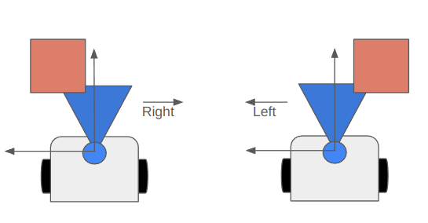
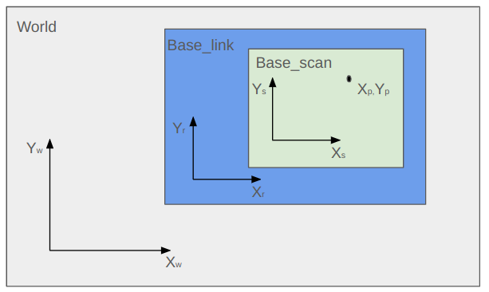
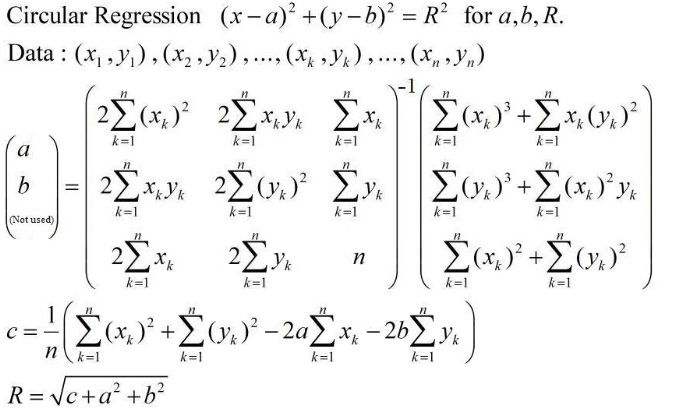
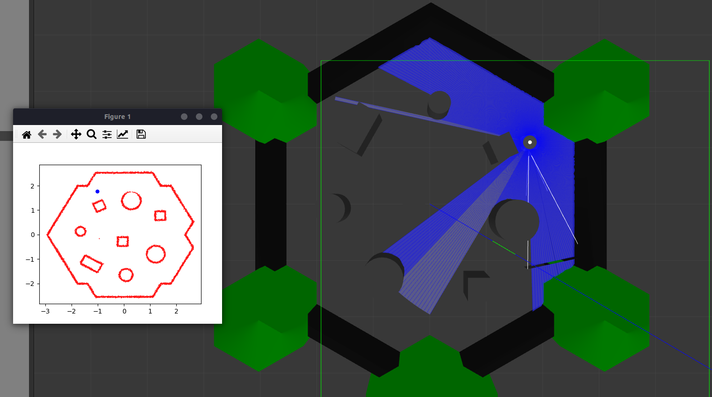
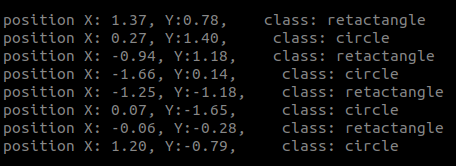

# obstacle_classifier

Este projeto tem o objetivo de localizar e identificar obstáculos de formas cilíndricas e retangulares em um ambiente simulado pelo ROS 2, utilizando o pacote do [TurtleBot 3](https://emanual.robotis.com/docs/en/platform/turtlebot3/overview/) e o software de simulação [Gazebo](https://gazebosim.org/home). 


## Dependências Principais 

- [ROS2 - Humble](https://docs.ros.org/en/humble/index.html)
- Python 3
- [Ubuntu 22.04](https://releases.ubuntu.com/jammy/)

### Pacotes do ROS2

- [Turtlebot3](https://github.com/ROBOTIS-GIT/turtlebot3.git)
- [Turtlebot3_simulations](https://github.com/ROBOTIS-GIT/turtlebot3_simulations.git)
- [Turtlebot3_msgs](https://github.com/ROBOTIS-GIT/turtlebot3_msgs)


### Pacotes do Python

- [Numpy](https://pypi.org/project/numpy/)
- [Sklear](https://scikit-learn.org/stable/install.html)
- [Matplotlib](https://pypi.org/project/scikit-learn/)
- Rclpy (Pacote do ROS2)

## Metodologia

Inicialmente é gerado de forma aleatória, posições dos obstáculos no mundo e a do robô. Quantidades e tamanho do obstáculo também é posto de forma aleatória no mundo, podendo diversificar o padrão de identificação.

### Navegação autônoma

A navegação do robô no mundo é realizada de forma automatica, se movendo linearmente até o encontro de um obstaculo a frente, fazendo uma parada e rotacionando aaté o obstaculo sair do ranger de detecção pelo laser Ylidar. A Figura abaixo representa como é realizado esta navegação.

<p align="center">
    
</p>


O objetivo dessa locomoção é percorrer todo o ambiente para coletar dados de posição de cada obstaculo no mundo, sendo que o critério de parada é quando o robô mapear toda a parede de fora até um contador atingir a quantidade de pontos de a parede contém.

### Coleta de dados

O sensor Ylidar do robô coleta dados sobre a posição dos obstáculos no ambiente. Essa informação está no referencial do robô, portanto, a fim de localizar os obstáculos no mundo, é necessário efetuar as transformações de referencial desde o ponto observado pelo Ylidar até o referencial do mundo, passando pelo referencial do robô conhecido no ambiente. A Figura abaixo representa essa transformação.

<p align="center">
    
</p>

### Clusterização 

Após a coleta de dados das posições de todos os obstáculos no ambiente, essas informações de posição são então organizadas em clusters de pontos realizado pela biblioteca [Sklear](https://scikit-learn.org/stable/install.html) utilizando o algoritmo de [DBSCAN](https://scikit-learn.org/stable/modules/clustering.html#dbscan). Cada cluster é composto por pontos bidimensionais (X e Y) que formam uma nuvem de pontos representando a posição de um obstáculo. A separação dos clusters é baseada na distância entre os pontos e na quantidade de pontos que compõem cada detecção de obstáculos. Portanto, se houver 9 obstáculos no ambiente, a etapa de clusterização resultará em 9 conjuntos distintos de nuvens de pontos, cada um representando um obstáculo.

### Classificação dos obstáculos

Cada cluster de pontos que representa um obstáculo pode adotar uma de duas formas: circular ou retangular. Para determinar essa classificação, emprega-se uma técnica de regressão não linear, que estima círculos em torno desses pontos. O erro mínimos quadráticos dessa regressão fornece uma indicação do tipo de obstáculo que o cluster representa. Se o erro for consideravelmente maior em comparação com os clusters circulares, o obstáculo é classificado como retangular; caso o erro seja próximo de zero, o obstáculo é considerado circular. O algoritmo utilizado para essa regressão por ser visto neste [link](https://github.com/AtsushiSakai/PythonRobotics/blob/master/Mapping/circle_fitting/circle_fitting.py). A equação dos erro minimos quadrados pode ser vista abaixo:

<p align="center">
    
</p>


## Resultados

Resultado pode ser visto abaixo, junto com a identificação, classificação e localização dos obstáculos. 

### Identificação

<p align="center">
    
</p>

### Classificação e localização

<p align="center">
    
</p>


## Como usar

Criar workspace:
```bash
 mkdir -p ./ros2_ws/src
```
```bash
cd -p ./ros2_ws/src
```

Realizar o clone do repositorio com comando abaixo:
```bash
https://github.com/MateusSMenines/obstacle_classifier.git
```

Compilar os pacotes:
```bash
cd ..
```
```bash
colcon build
```

executar o launch:
```bash
ros2 launch object_classifier object_classifier.launch.py x_pose:=X y_pose:=Y
```

Essa Pose X e Y é do spawner do robô no mundo, substitua por um valor.

Para modificar o mundo, ir no diretório _launch/_ e aonde estiver especificado:

   world = os.path.join(
        get_package_share_directory('turtlebot3_gazebo'),
        'worlds',
        'g1w1.world'


